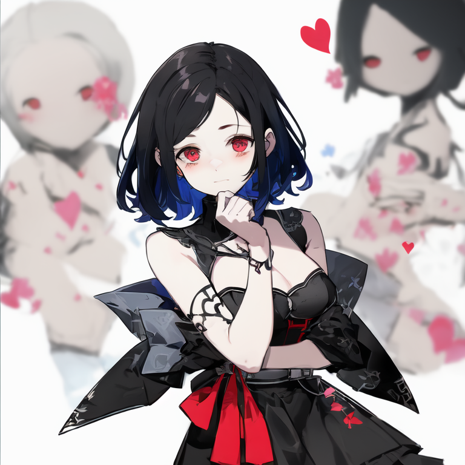
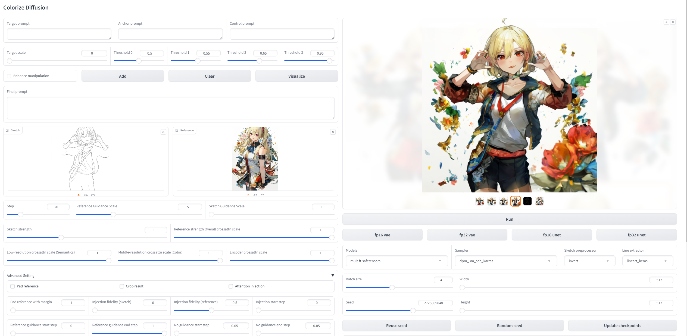
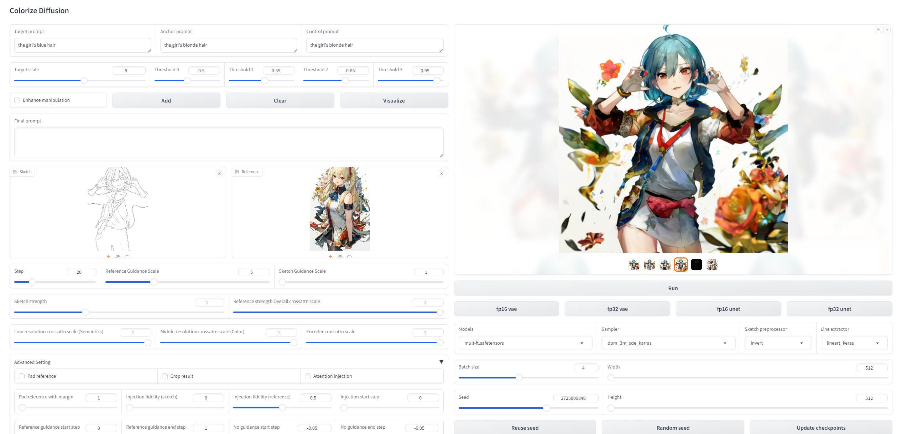

# ColorizeDiffusion: Adjustable Sketch Colorization with Reference Image and Text


(March. 2025)
Fundemental issue for this repository: [ColorizeDiffusion (e-print)](https://arxiv.org/abs/2401.01456).  
Version 1 - trained with 512px (WACV 2025): [ColorizeDiffusion](https://openaccess.thecvf.com/content/WACV2025/html/Yan_ColorizeDiffusion_Improving_Reference-Based_Sketch_Colorization_with_Latent_Diffusion_Model_WACV_2025_paper.html) Basic reference-based training. Released.  
Version 1.5 - trained with 512px (CVPR 2025): [ColorizeDiffusion 1.5 (e-preprint)](https://arxiv.org/html/2502.19937v1) Solving spatial entangelment. Released.  
Version 2 - trained with 768px, paper and code: Enhancing background and style transfer. Available soon.  
Version XL - trained with 1024px : Enhancing embedding guidance for character colorization, geometry disentanglement. Ongoing.  

Model weights are available: https://huggingface.co/tellurion/colorizer.

## Implementation Details
The repository offers the implementation of ColorizeDiffusion.  
Now, only the noisy model introduced in the paper, which utilizes the local tokens.

## Getting Start
To utilize the code in this repository, ensure that you have installed the required dependencies as specified in the requirements.

### To install and run:
```shell
conda env create -f environment.yaml
conda activate hf
```

## User Interface:
We also provided a Web UI based on Gradio UI. To run it, just:
```shell
python -u app.py
```
Then you can browse the UI in http://localhost:7860/.

### Inference:
-------------------------------------------------------------------------------------------
#### Important inference options:
| Options                   | Description                                                                       |
|:--------------------------|:----------------------------------------------------------------------------------|
| Mask guide mode           | Activate mask guided attention and corresponding lora weights for colorization.   | 
| Crossattn scale           | Used to diminish all kinds of artifacts caused by the distribution problem.       |
| Pad reference with margin | Used to diminish spatial entanglement, pad reference to T times of current width. |
| Reference guidance scale  | Classifier-free guidance scale of the reference image, suggested 5.               |
| Sketch guidance scale     | Classifier-free guidance scale of the sketch image, suggested 1.                  |
| Attention injection       | Strengthen similarity with reference.                                             |
| Visualize                 | Used for local manipulation. Visualize the regions selected by each threshold.    |

For artifacts like spatial entanglement (the distribution problem discussed in the paper) like this
  
Please activate background enhance (optionally with foreground enhance).

### Manipulation:
The colorization results can be manipulated using text prompts.

For local manipulations, a visualization is provided to show the correlation between each prompt and tokens in the reference image.


The manipulation result and correlation visualization of the settings:
    
    Target prompt: the girl's blonde hair
    Anchor prompt the girl's brown hair
    Control prompt the girl's brown hair, 
    Target scale: 8
    Enhanced: false
    Thresholds: 0.5、0.55、0.65、0.95



As you can see, the manipluation unavoidably changed some unrelated regions as it is taken on the reference embeddings.

#### Manipulation options:
| Options                   | Description                                                                                                                                                                                                       |
| :-----                    |:------------------------------------------------------------------------------------------------------------------------------------------------------------------------------------------------------------------|
| Group index               | The index of selected manipulation sequences's parameter group.                                                                                                                                                   |
| Target prompt             | The prompt used to specify the desired visual attribute for the image after manipulation.                                                                                                                         |
| Anchor prompt             | The prompt to specify the anchored visaul attribute for the image before manipulation.                                                                                                                            |
| Control prompt            | Used for local manipulation (crossattn-based models). The prompt to specify the target regions.                                                                                                                   |
| Enhance                   | Specify whether this manipulation should be enhanced or not. (More likely to influence unrelated attribute).                                                                                                      |
| Target scale              | The scale used to progressively control the manipulation.                                                                                                                                                         |
| Thresholds                | Used for local manipulation (crossattn-based models). Four hyperparameters used to reduce the influnece on irrelevant visual attributes, where 0.0 < threshold 0 < threshold 1 < threshold 2 < threshold 3 < 1.0. |
| \<Threshold0 				| Select regions most related to control prompt. Indicated by deep blue.                                                                                                                                            |
| Threshold0-Threshold1     | Select regions related to control prompt. Indicated by blue.                                                                                                                                                      |
| Threshold1-Threshold2		| Select neighbouring but unrelated regions. Indicated by green.                                                                                                                                                    |
| Threshold2-Threshold3		| Select unrelated regions. Indicated by orange.                                                                                                                                                                    |
| \>Threshold3				| Select most unrelated regions. Indicated by brown.                                                                                                                                                                |
|Add| Click add to save current manipulation in the sequence.        |  

## Code reference
1. [Stable Diffusion v2](https://github.com/Stability-AI/stablediffusion)
2. [Stable Diffusion XL](https://github.com/Stability-AI/generative-models)
3. [SD-webui-ControlNet](https://github.com/Mikubill/sd-webui-controlnet)
4. [Stable-Diffusion-webui](https://github.com/AUTOMATIC1111/stable-diffusion-webui)
5. [K-diffusion](https://github.com/crowsonkb/k-diffusion)
6. [Deepspeed](https://github.com/microsoft/DeepSpeed)
7. [sketchKeras-PyTorch](https://github.com/higumax/sketchKeras-pytorch)

## Citation
```
@article{2024arXiv240101456Y,
       author = {{Yan}, Dingkun and {Yuan}, Liang and {Wu}, Erwin and {Nishioka}, Yuma and {Fujishiro}, Issei and {Saito}, Suguru},
        title = "{ColorizeDiffusion: Adjustable Sketch Colorization with Reference Image and Text}",
      journal = {arXiv e-prints},
         year = {2024},
          doi = {10.48550/arXiv.2401.01456},
}

@InProceedings{Yan_2025_WACV,
    author    = {Yan, Dingkun and Yuan, Liang and Wu, Erwin and Nishioka, Yuma and Fujishiro, Issei and Saito, Suguru},
    title     = {ColorizeDiffusion: Improving Reference-Based Sketch Colorization with Latent Diffusion Model},
    booktitle = {Proceedings of the Winter Conference on Applications of Computer Vision (WACV)},
    year      = {2025},
    pages     = {5092-5102}
}

@article{2025arXiv250219937Y,
    author = {{Yan}, Dingkun and {Wang}, Xinrui and {Li}, Zhuoru and {Saito}, Suguru and {Iwasawa}, Yusuke and {Matsuo}, Yutaka and {Guo}, Jiaxian},
    title = "{Image Referenced Sketch Colorization Based on Animation Creation Workflow}",
    journal = {arXiv e-prints},
    year = {2025},
    doi = {10.48550/arXiv.2502.19937},
}
```