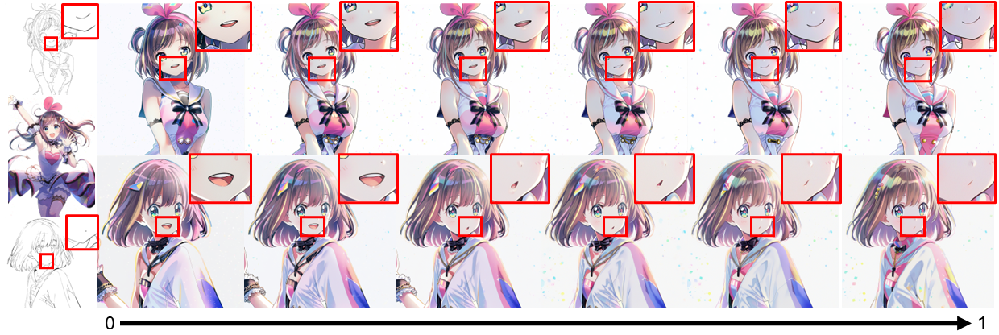

# ColorizeDiffusion: Adjustable Sketch Colorization with Reference Image and Text

<div align="center">

[-B31B1B?style=flat&logo=arXiv)](https://arxiv.org/abs/2401.01456)
[](https://openaccess.thecvf.com/content/WACV2025/html/Yan_ColorizeDiffusion_Improving_Reference-Based_Sketch_Colorization_with_Latent_Diffusion_Model_WACV_2025_paper.html)
[](https://arxiv.org/abs/2502.19937)
[-B31B1B?style=flat&logo=arXiv)](https://arxiv.org/abs/2504.06895)
[](https://huggingface.co/tellurion/ColorizeDiffusion/tree/main)
[](https://github.com/tellurion-kanata/colorizeDiffusion/blob/master/LICENSE)

</div>


(April. 2025)
Official implementation of Colorize Diffusion.  

Colorize Diffusion is a SD-based colorization framework that can achieve high-quality colorization results with arbitrary input pairs.

Fundamental issue for this repository: [ColorizeDiffusion (e-print)](https://arxiv.org/abs/2401.01456).  
***Version 1*** - Base training, 512px. Released, ckpt starts with **mult**.   
***Version 1.5*** - Solving spatial entanglement, 512px. Released, ckpt starts with **switch**.  
***Version 2*** - Enhancing background and style transfer, 768px. Released, ckpt starts with **v2**.  
***Version XL*** - Enhancing embedding guidance for character colorization, geometry disentanglement, 1024px. Available soon.  


## Getting Start

-------------------------------------------------------------------------------------------
```shell
conda env create -f environment.yaml
conda activate hf
```

## User Interface

-------------------------------------------------------------------------------------------
We implement a fully-featured UI. To run it, just:
```shell
python -u app.py
```
The default server address is http://localhost:7860.

#### Important inference options
| Options               | Description                                                                                        |
|:----------------------|:---------------------------------------------------------------------------------------------------|
| BG enhance            | Low-level feature injection for backgrounds in v2 models.                                          |
| Style enhance         | Low-level feature injection for style details in v2 models.                                        |
| FG enhance            | Useless for currently open-sourced models.                                                         |
| Reference strength    | Decreasing it to increase semantic fidelity to sketch inputs.                                      |
| Foreground strength   | Similar to reference strength but only for foreground region. Need to activate FG or BG enhance.   |
| Preprocessor          | Sketch preprocessing. **Extract** is suggested if the sketch input is complicated pencil drawing.  |
| Line extractor        | Line extractors used when preprocessor is **Extract**.                                             |
| Sketch guidance scale | Classifier-free guidance scale of the sketch image, suggested 1.                                   |
| Attention injection   | Noised low-level feature injection, 2x inference time.                                             |


### 768-level Cross-content colorization results (from v2)


### 1536-level Character colorization results (from XL)



## Manipulation

-------------------------------------------------------------------------------------------
The colorization results can be manipulated using text prompts, see [ColorizeDiffusion (e-print)](https://arxiv.org/abs/2401.01456).

It is now deactivated by default. To activate it, use
```shell
python -u app.py -manipulate
```

For local manipulations, a visualization is provided to show the correlation between each prompt and tokens in the reference image.


The manipulation result and correlation visualization of the settings:
    
    Target prompt: the girl's blonde hair
    Anchor prompt the girl's brown hair
    Control prompt the girl's brown hair, 
    Target scale: 8
    Enhanced: false
    Thresholds: 0.5、0.55、0.65、0.95


As you can see, the manipluation unavoidably changed some unrelated regions as it is taken on the reference embeddings.

#### Manipulation options
| Options                   | Description                                                                                                                                                                                                       |
| :-----                    |:------------------------------------------------------------------------------------------------------------------------------------------------------------------------------------------------------------------|
| Group index               | The index of selected manipulation sequences's parameter group.                                                                                                                                                   |
| Target prompt             | The prompt used to specify the desired visual attribute for the image after manipulation.                                                                                                                         |
| Anchor prompt             | The prompt to specify the anchored visaul attribute for the image before manipulation.                                                                                                                            |
| Control prompt            | Used for local manipulation (crossattn-based models). The prompt to specify the target regions.                                                                                                                   |
| Enhance                   | Specify whether this manipulation should be enhanced or not. (More likely to influence unrelated attribute).                                                                                                      |
| Target scale              | The scale used to progressively control the manipulation.                                                                                                                                                         |
| Thresholds                | Used for local manipulation (crossattn-based models). Four hyperparameters used to reduce the influnece on irrelevant visual attributes, where 0.0 < threshold 0 < threshold 1 < threshold 2 < threshold 3 < 1.0. |
| \<Threshold0 				| Select regions most related to control prompt. Indicated by deep blue.                                                                                                                                            |
| Threshold0-Threshold1     | Select regions related to control prompt. Indicated by blue.                                                                                                                                                      |
| Threshold1-Threshold2		| Select neighbouring but unrelated regions. Indicated by green.                                                                                                                                                    |
| Threshold2-Threshold3		| Select unrelated regions. Indicated by orange.                                                                                                                                                                    |
| \>Threshold3				| Select most unrelated regions. Indicated by brown.                                                                                                                                                                |
|Add| Click add to save current manipulation in the sequence.        |  


## Training & inference & validation
Our implementation is based on Accelerate and Deepspeed.  
Before starting a training, first collect data and organize your training dataset as follows:

```
[dataset_path]
├── image_list.json    # Optionally for image indexing
├── color              # Color images
│   ├── 0001.zip        
|   |   ├── 10001.png
|   |   ├── 100001.jpg
│   |   └── ...
│   ├── 0002.zip
│   └── ...
├── sketch             # Sketch images
│   ├── 0001.zip
|   |   ├── 10001.png
|   |   ├── 100001.jpg
│   |   └── ...
│   ├── 0002.zip
│   └── ...
└── mask               # Mask images (required for fg-bg training)
    ├── 0001.zip
    |   ├── 10001.png
    |   ├── 100001.jpg
    |   └── ...
    ├── 0002.zip
    └── ...
```
For details of dataset organization, check `data/dataloader.py`.  
Training command example:
```
accelerate launch --config_file [accelerate_config_file] \
    train.py \
    --name base \
    --dataroot [dataset_path] \
    --batch_size 64 \
    --num_threads 8 \
    -cfg configs/train/sd2.1/mult.yaml \
    -pt [pretrained_model_path]
```
Note that the `batch size` here is micro batch size per gpu. If you run the command on 8 gpus, the total batch size is 512.

Inference example:
```
python inference.py
    --name inf \
    --dataroot [dataset_path] \
    --batch_size 64 \
    --num_threads 8 \
    -cfg configs/inference/val.yaml \ (for mult/switch-eps models)
    -cfg configs/inference/v2-val.yaml \ (for v2 models)
    -pt [pretrained_model_path]
    -gs 5
```

Validation example:
```
python inference.py
    --name val \
    --dataroot [dataset_path] \
    --batch_size 64 \
    --num_threads 8 \
    -cfg configs/inference/val.yaml \ (for mult/switch-eps models)
    -cfg configs/inference/v2-val.yaml \ (for v2 models)
    -pt [pretrained_model_path]
    -gs 5
    -val
```

The difference between inference and validation modes is that validation mode use randomly selected images as reference inputs.
Refer to `options.py` for full arguments.  

  


## Code reference
1. [Stable Diffusion v2](https://github.com/Stability-AI/stablediffusion)
2. [Stable Diffusion XL](https://github.com/Stability-AI/generative-models)
3. [SD-webui-ControlNet](https://github.com/Mikubill/sd-webui-controlnet)
4. [Stable-Diffusion-webui](https://github.com/AUTOMATIC1111/stable-diffusion-webui)
5. [K-diffusion](https://github.com/crowsonkb/k-diffusion)
6. [Deepspeed](https://github.com/microsoft/DeepSpeed)
7. [sketchKeras-PyTorch](https://github.com/higumax/sketchKeras-pytorch)

## Citation
```
@article{2024arXiv240101456Y,
       author = {{Yan}, Dingkun and {Yuan}, Liang and {Wu}, Erwin and {Nishioka}, Yuma and {Fujishiro}, Issei and {Saito}, Suguru},
        title = "{ColorizeDiffusion: Adjustable Sketch Colorization with Reference Image and Text}",
      journal = {arXiv e-prints},
         year = {2024},
          doi = {10.48550/arXiv.2401.01456},
}

@InProceedings{Yan_2025_WACV,
    author    = {Yan, Dingkun and Yuan, Liang and Wu, Erwin and Nishioka, Yuma and Fujishiro, Issei and Saito, Suguru},
    title     = {ColorizeDiffusion: Improving Reference-Based Sketch Colorization with Latent Diffusion Model},
    booktitle = {Proceedings of the Winter Conference on Applications of Computer Vision (WACV)},
    year      = {2025},
    pages     = {5092-5102}
}

@article{2025arXiv250219937Y,
    author = {{Yan}, Dingkun and {Wang}, Xinrui and {Li}, Zhuoru and {Saito}, Suguru and {Iwasawa}, Yusuke and {Matsuo}, Yutaka and {Guo}, Jiaxian},
    title = "{Image Referenced Sketch Colorization Based on Animation Creation Workflow}",
    journal = {arXiv e-prints},
    year = {2025},
    doi = {10.48550/arXiv.2502.19937},
}

@article{yan2025colorizediffusionv2enhancingreferencebased,
      title={ColorizeDiffusion v2: Enhancing Reference-based Sketch Colorization Through Separating Utilities}, 
      author={Dingkun Yan and Xinrui Wang and Yusuke Iwasawa and Yutaka Matsuo and Suguru Saito and Jiaxian Guo},
      year={2025},
      journal = {arXiv e-prints},
      doi = {10.48550/arXiv.2504.06895},
}